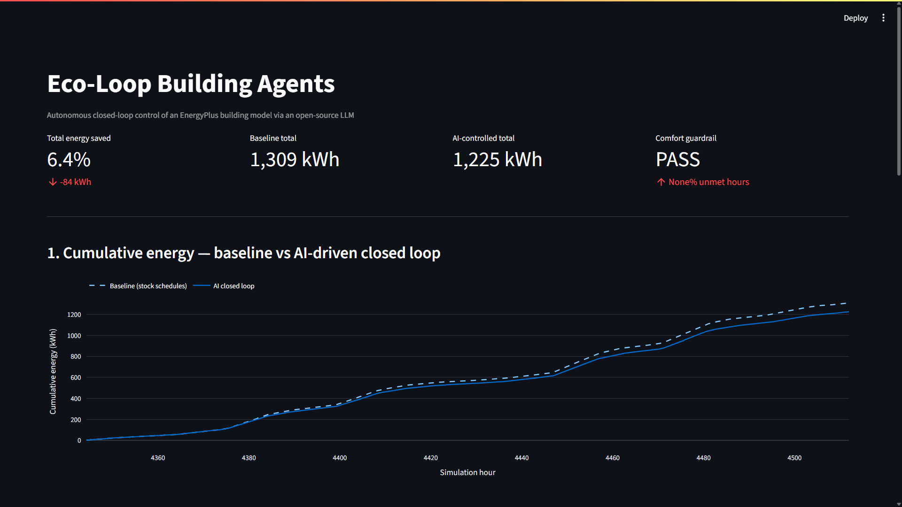
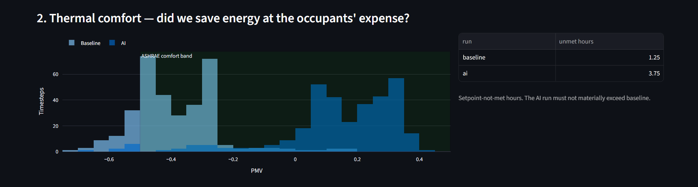
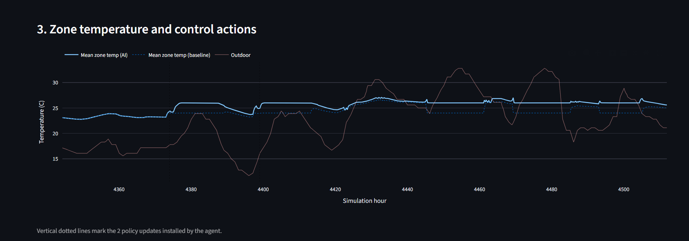
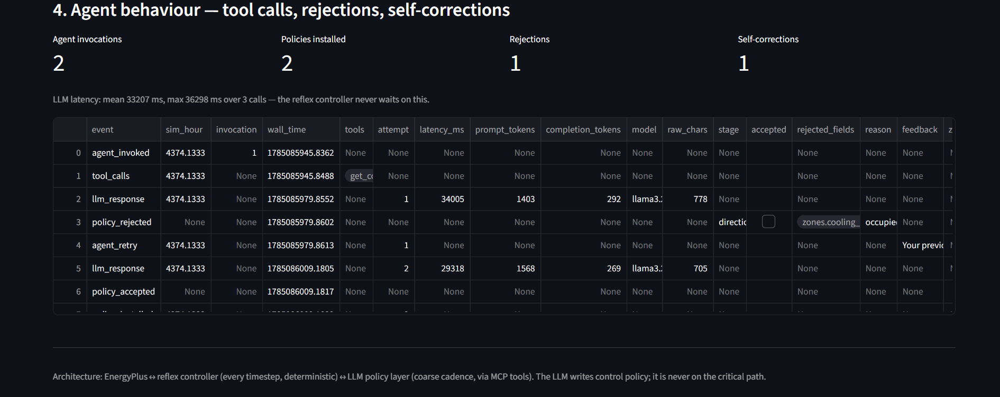
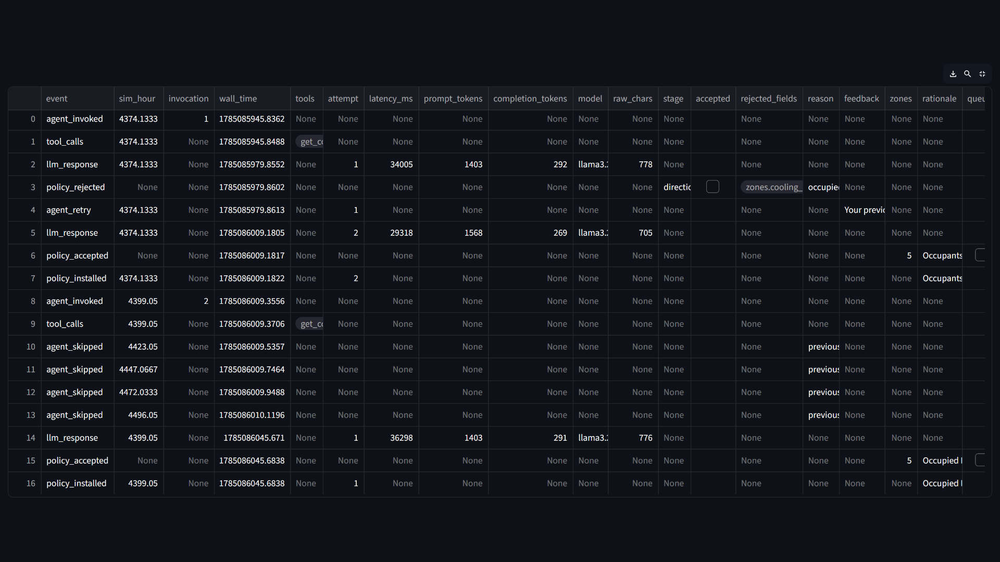

# Eco-Loop Building Agents

Autonomous closed-loop control of a building energy simulation, driven by an
open-source LLM through MCP tools.

**Hackathon problem statement:** Q1 — Eco-Loop Building Agents (EnergyPlus + OSS LLM + MCP)

---

## The architecture in one paragraph

An annual EnergyPlus simulation is ~35,000 timesteps. Putting an LLM inside the
timestep callback means ~10 h of wall clock and one malformed response away from a
dead run. So this project splits the controller in two: a **reflex tier** of pure
arithmetic runs every timestep and writes setpoints, and a **cognitive tier** —
the LLM, reached over MCP — runs on a coarse cadence and rewrites the *policy* the
reflex tier executes. The LLM is never on the critical path. If the model server
dies mid-run, the simulation completes on the last-known-good policy.

This is supervisory MPC with an LLM policy layer. Hierarchical control is standard
practice in real building management systems.

```
EnergyPlus  ──sensors──▶  SensorBus  ──aggregates──▶  AgentLoop (LLM via MCP)
    ▲                        │                              │
    │                        ▼                              ▼
    └──setpoints──  PolicyExecutor  ◀──validated policy── commit_policy
                    (every timestep,                    (schema + clamp)
                     pure, cannot fail)
```

Two independent safety layers: Pydantic bounds in `schemas.py`, then a hard clamp
in `policy_executor.py`. A hallucinated setpoint is physically incapable of
reaching the simulation — see `tests/test_policy_executor.py`.

---

## Results

7-day July A/B on the DOE reference small office (Chicago TMY3). Identical model,
identical weather — only the controller differs. Policy authored by `llama3.2:3b`
running locally, temperature 0, so the run is reproducible.

| Metric | Baseline | Eco-Loop | Change |
|---|---|---|---|
| Electricity | 1251.97 kWh | 1167.33 kWh | **−6.76 %** |
| Total energy | 1309.46 kWh | 1225.14 kWh | **−6.44 %** |
| Peak demand | 18.97 kW | 17.52 kW | **−7.64 %** |
| Mean occupied PMV | −0.391 | **+0.140** | toward neutral |
| PMV within comfort band | 82.8 % | **97.3 %** | +14.5 pp |

Energy **and** comfort improved together: the stock schedule overcools (PMV
−0.39), so raising the occupied cooling setpoint cuts cooling energy while moving
comfort toward neutral. The LLM-authored policy also beats a hand-tuned static
policy (−5.08 %) on the same model.

### Cumulative energy — baseline vs closed loop



### Thermal comfort — occupied hours only

PMV distribution against the shaded ASHRAE 55 comfort band. Comfort is scored only
while zones are actually occupied; measuring an empty building penalises correct
setback.



### Control actions in the loop

Zone and outdoor temperature, with vertical markers where the agent installed a
new policy.



### Agent behaviour — tool calls, rejections, self-correction



The model proposed an invalid setpoint, `commit_policy` rejected it with the
offending field and reason, that text was appended to the retry prompt, and the
corrected policy was accepted on attempt 2 — visible in the trace as two
`llm_response` events at the same `sim_hour`.



Reproduce all of the above with `streamlit run src/dashboard.py`.

---

## Quick start

```bash
# 0. deps  (pyenergyplus is NOT pip-installable — it ships with EnergyPlus)
pip install -r requirements.txt

# 1. point config.yaml at your EnergyPlus install, then prepare a model
python scripts/instrument_idf.py \
    --source "C:/EnergyPlusV24-1-0/ExampleFiles/RefBldgSmallOfficeNew2004_Chicago.idf" \
    --run-period-days 7
#    -> paste the printed zones / people_objects into config.yaml

# 2. pre-flight: checks EnergyPlus, IDF, EPW and the LLM endpoint
python -m src.runner --check

# 3. baseline run (no control writes)
python -m src.runner --mode baseline

# 4. confirm the actuators actually exist for this model
python scripts/dump_actuators.py

# 5. static-policy run — no LLM needed, proves the write path works
python -m src.runner --mode static

# 6. full closed loop (needs the LLM server up)
ollama serve && ollama pull llama3.1:8b
python -m src.runner --mode ai

# 7. savings + comfort verdict
python scripts/compare_runs.py

# 8. dashboard
streamlit run src/dashboard.py
```

Run the MCP server standalone to drive the building from any MCP client:

```bash
python -m src.mcp_server
```

---

## Layout

| Path | Role |
|---|---|
| `config.yaml` | Every path, bound and cadence. Nothing is hardcoded in `src/`. |
| `src/config.py` | Config loading + `pyenergyplus` bootstrapping from the install root |
| `src/schemas.py` | Pydantic `Policy` — safety layer 1, structured rejections |
| `src/policy_executor.py` | **Tier 1.** Pure, dependency-free, hard-clamped. Cannot fail. |
| `src/sensor_bus.py` | Handle binding, warmup guard, ring buffer, aggregation |
| `src/runtime_store.py` | Atomic file-backed state shared with the MCP server |
| `src/tools.py` | Tool implementations — used by both the agent and the MCP server |
| `src/llm_client.py` | OpenAI-compatible client (Ollama / vLLM), JSON mode |
| `src/agent_loop.py` | **Tier 2.** Threaded, timeout, retry with error feedback |
| `src/mcp_server.py` | FastMCP exposure of the same tools |
| `src/runner.py` | Orchestrator: `--mode baseline\|static\|ai`, `--check` |
| `src/dashboard.py` | Streamlit savings dashboard (deliverable #3) |
| `scripts/instrument_idf.py` | Enables Fanger PMV, EMS reporting, output variables |
| `scripts/dump_actuators.py` | Parses `eplusout.edd` — the real actuator list |
| `scripts/compare_runs.py` | A/B savings + comfort guardrail verdict |
| `deck/` | SIH presentation template |
| `docs/` | Architecture and prompt-engineering write-ups (deliverable #4) |

---

## Three traps this repo already handles

1. **Guessed actuator names fail silently.** `get_actuator_handle` returns `-1`
   and every write becomes a no-op — the simulation runs beautifully and controls
   nothing. `scripts/dump_actuators.py` reads `eplusout.edd` for ground truth, and
   `SensorBus.assert_bound_ok()` refuses to continue on a bad handle.
2. **PMV is not reported by default.** The rubric names PMV explicitly, but
   EnergyPlus only emits it when the Fanger model is enabled on every `People`
   object — which itself requires work-efficiency, clothing and air-velocity
   schedules to exist. `scripts/instrument_idf.py` does all of it.
3. **NaN defeats a naive clamp.** `nan < lo` and `nan > hi` are both `False`, so
   NaN sails through `min`/`max`-style clamping straight into
   `set_actuator_value`. `_clamp` checks `math.isfinite` first; there is a test
   for it.

---

## Deliverables map (spec §Deliverables)

| # | Required | Where |
|---|---|---|
| 1 | Fully functional source code | `src/` — E+ wrapper, agent orchestration, comms bus |
| 2 | Building models (`.idf`) | `models/baseline.idf`, `models/ai_instrumented.idf`, `models/generated/` |
| 3 | Quantitative savings dashboard | `src/dashboard.py`, `scripts/compare_runs.py` → `results/comparison.json` |
| 4 | System architecture document | `docs/architecture.md`, `docs/prompt_engineering.md` |
| 5 | PoC demonstration video (≤3 min) | **[Watch the demo](https://drive.google.com/drive/folders/1BnIvuYQWBIXOHk3vVQ0LGkk2cF6vWLvq?usp=sharing)** · script in `docs/video_script.md` |
|   | Presentation | `deck/Eco-Loop_IDEA_Submission.pdf` (built from the provided template) |
|   | Dashboard screenshots | `docs/screenshots/` |

Submission format: **PDF or ZIP only.**

---

## Testing

```bash
pytest -q
```

The tests are the evidence for the safety claims: absurd setpoints, NaN, inf,
zero deadband, unknown zone names, and fallback-to-default all get clamped or
handled without raising.

---

<div align="center">

**Made by Divyansh Mishra**

[GitHub](https://github.com/DivyanshM30) · [Portfolio](https://divyanshm.dev/) · [LinkedIn](https://linkedin.com/in/divyanshm30)

</div>
